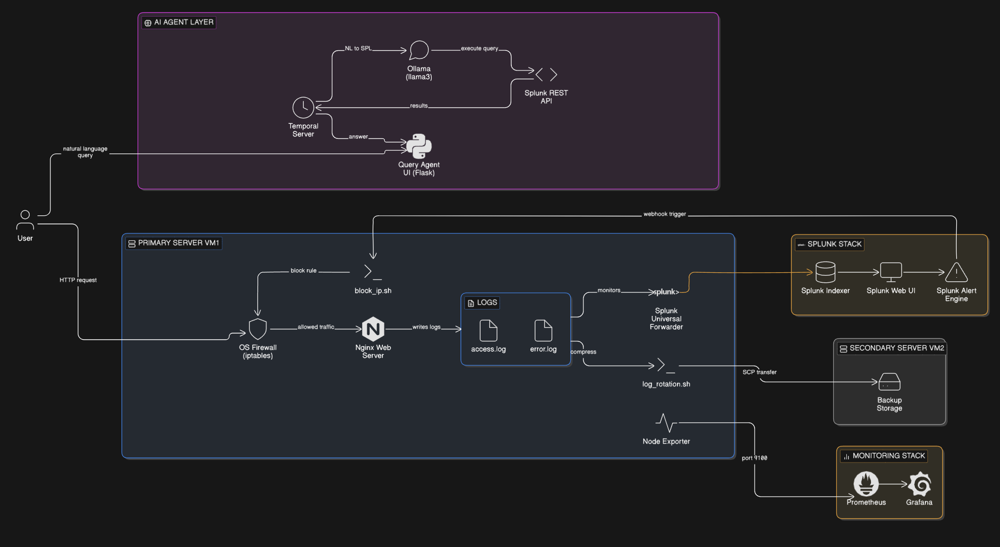
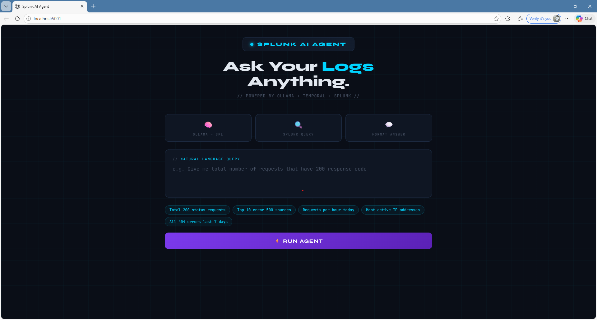
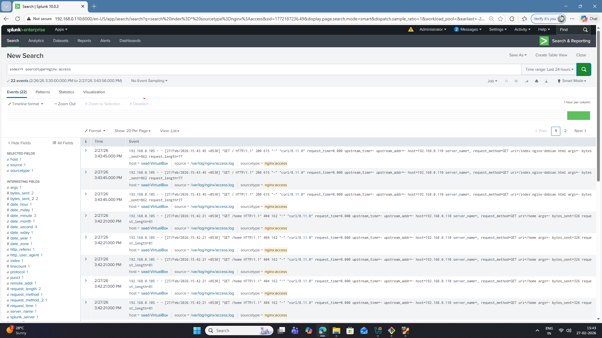
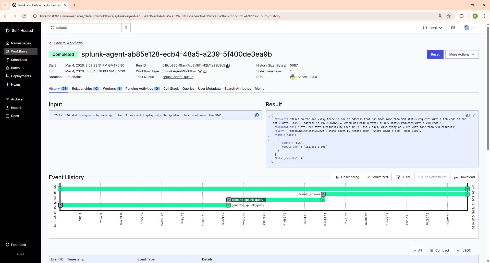
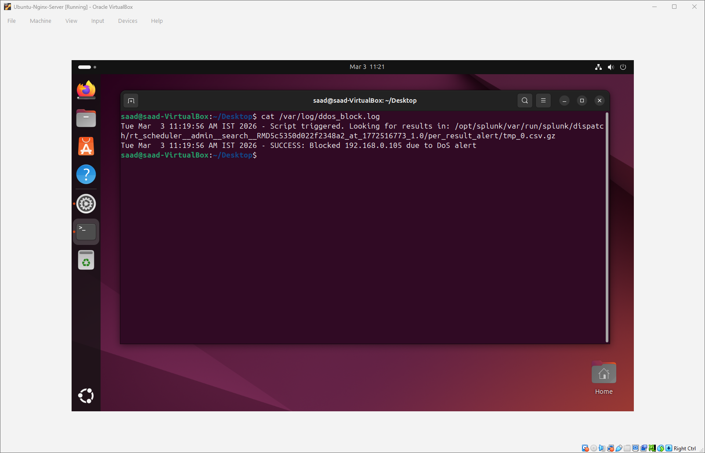
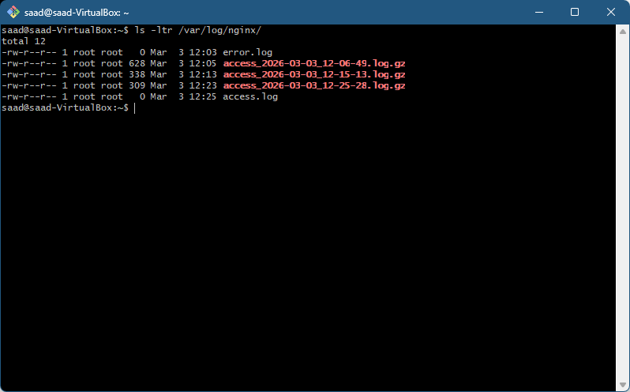
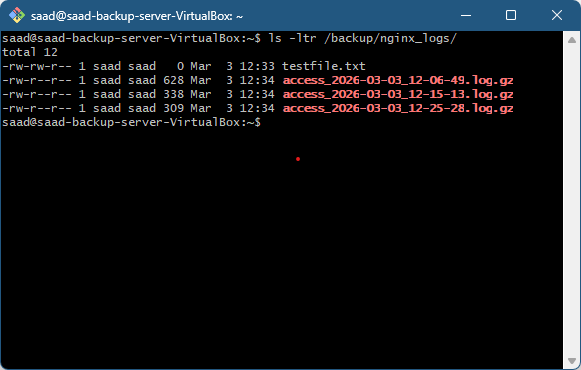

# nginx-ai-ops

> Agentic AI system that converts natural language to Splunk queries, monitors nginx infrastructure with Prometheus & Grafana, and automates log management — all running locally with Ollama + Temporal.

---

## 🏗️ Architecture



---

## 📸 Preview

### Query Agent UI


### Grafana Monitoring Dashboard


---

## 📁 Project Structure

```
nginx-ai-ops/
│
├── agents/
│   └── query_agent/        ✅ Natural language → Splunk queries
│
├── nginx/                  ✅ Nginx config with custom Splunk log format
│
├── splunk/                 ✅ Splunk Forwarder + Indexer configuration
│   ├── forwarder/
│   └── indexer/
│
├── monitoring/             ✅ Prometheus + Grafana stack
│   ├── prometheus/
│   └── grafana/
│
├── automation/             ✅ Log rotation + IP blocking scripts
│
└── docs/
    └── screenshots/
```

---

## ✅ What's Built

### 🔍 AI Query Agent — `agents/query_agent`

Ask your nginx logs anything in plain English. The agent generates the Splunk SPL query, runs it against your Splunk server, and returns a human-readable answer.

```
"Give me total requests with 200 status code in last 15 days"
        ↓
index=nginx earliest=-15d status=200 | stats count
        ↓
"There were 24,391 successful requests with a 200 status code
 over the last 15 days."
```

### 🌐 Nginx — `nginx/`

Custom nginx configuration with a Splunk-optimized log format. Every field (`remote_addr`, `status`, `uri`, `request_time` etc.) is explicitly named so Splunk can extract them automatically — no manual field extraction needed.

### 📊 Splunk Stack — `splunk/`

Splunk Universal Forwarder monitors `/var/log/nginx/` and ships logs to the Splunk Indexer in real time. Includes alerting that automatically triggers IP blocking when a threshold is exceeded.

### 📈 Monitoring Stack — `monitoring/`

Node Exporter collects VM system metrics (CPU, RAM, disk, network), Prometheus scrapes every 15 seconds, and Grafana visualizes everything using the Node Exporter Full dashboard (ID: 1860).

### ⚙️ Automation — `automation/`

Two shell scripts that run automatically:
- `log_rotation.sh` — compresses nginx logs every 10 minutes, keeps 3 backups, SCPs to VM2
- `block_ip.sh` — triggered by Splunk alert, blocks attacker IP via `iptables -I INPUT -s <IP> -j DROP`

---

## 🛠️ Tech Stack

| Layer | Technology |
|---|---|
| Workflow Orchestration | [Temporal](https://temporal.io) |
| Local LLM | [Ollama](https://ollama.ai) (llama3) |
| Log Analytics | [Splunk Enterprise](https://splunk.com) |
| Web Server | Nginx |
| Monitoring | Prometheus + Grafana + Node Exporter |
| Firewall | iptables |
| Scripting | Bash |
| Language | Python 3.10+ |

---

## ⚡ Quick Start

### Prerequisites
- Python 3.10+
- Ollama installed and running
- Splunk Enterprise with REST API on port 8089
- Temporal CLI installed
- Linux VM with SSH access

### Run Query Agent

```bash
# 1. Install dependencies
pip install -r requirements.txt

# 2. Pull Ollama model
ollama pull llama3

# 3. Configure Splunk credentials
# Edit agents/query_agent/activities.py
SPLUNK_HOST = "your-splunk-ip"
SPLUNK_PASS = "your-password"

# 4. Test Splunk connection
cd agents/query_agent
python test_splunk_auth.py

# 5. Start Temporal
temporal server start-dev

# 6. Run
python worker.py   # Terminal 1
python app.py      # Terminal 2
```

Open **http://localhost:5001**

---

## ✅ Proof of Work

### Splunk Query History
> Queries automatically generated and executed by the AI agent



### Temporal Workflow Execution
> Each workflow run showing all 3 steps completed successfully



### IP Blocked by Splunk Alert
> Splunk alert fires → block_ip.sh executes → IP dropped in iptables



### Log Rotation Running
> Compressed logs on main server — only 3 kept at a time



### Backup Received on VM2
> Same files received on backup server via SCP



---

## 📌 Roadmap

- [x] Natural language → Splunk query agent
- [x] Nginx custom log format for Splunk
- [x] Splunk Forwarder + Indexer setup
- [x] Prometheus + Grafana monitoring stack
- [x] Log rotation + backup automation
- [x] Automated IP blocking via Splunk alert

---

## 📄 License

MIT License — see [LICENSE](LICENSE) for details.