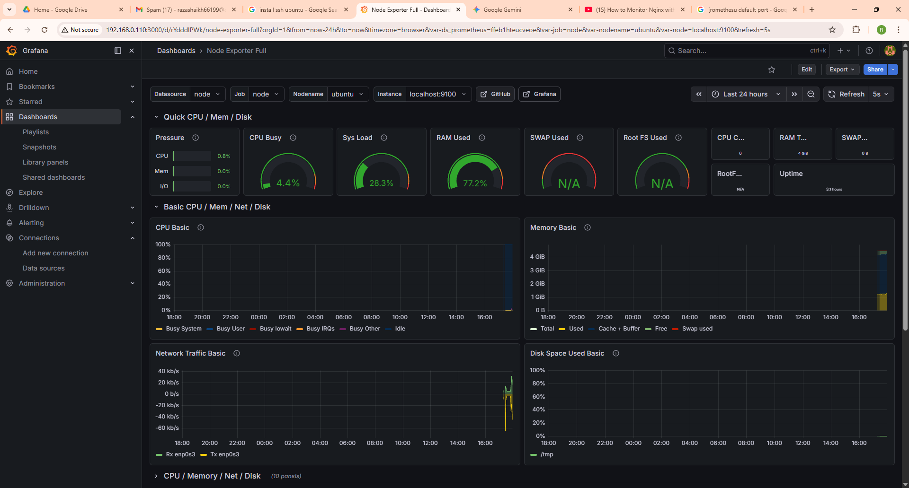
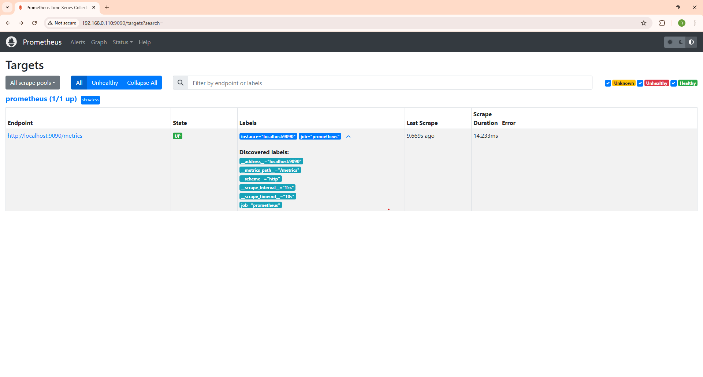
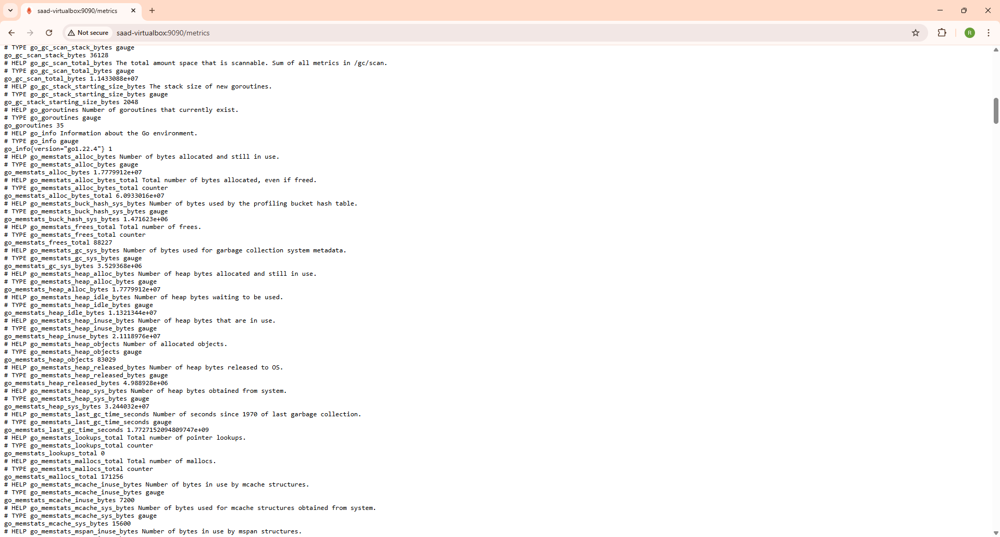

# 📈 Monitoring Stack

> VM system metrics collected by Node Exporter, scraped by Prometheus, and visualized in Grafana.

---

## Architecture

```
VM1 (Ubuntu)
    │
    ▼
Node Exporter (port 9100)
    │  CPU, RAM, Disk, Network metrics
    ▼
Prometheus (port 9090)
    │  Scrapes every 15 seconds
    ▼
Grafana (port 3000)
    │  Node Exporter Full Dashboard
    ▼
Visual Dashboards
```

---

## 📸 Grafana — Node Exporter Full Dashboard



---

## 📸 Prometheus — Targets




---

## 📁 Files

| File | Purpose |
|---|---|
| `prometheus/prometheus.yml` | Prometheus scrape configuration |
| `grafana/` | Grafana dashboard info |

---

## ⚙️ Setup

### 1. Install Node Exporter on VM

```bash
# Download latest Node Exporter
wget https://github.com/prometheus/node_exporter/releases/latest/download/node_exporter-1.9.0.linux-amd64.tar.gz

# Extract
tar xvf node_exporter-*.tar.gz
cd node_exporter-*

# Run
./node_exporter &

# Verify it's working
curl http://localhost:9100/metrics
```

**Run as a service (recommended):**
```bash
sudo useradd -rs /bin/false node_exporter

sudo nano /etc/systemd/system/node_exporter.service
```

Paste this:
```ini
[Unit]
Description=Node Exporter
After=network.target

[Service]
User=node_exporter
ExecStart=/usr/local/bin/node_exporter

[Install]
WantedBy=multi-user.target
```

```bash
sudo systemctl daemon-reload
sudo systemctl enable node_exporter
sudo systemctl start node_exporter
```

---

### 2. Install Prometheus

```bash
# Download
wget https://github.com/prometheus/prometheus/releases/latest/download/prometheus-2.53.0.linux-amd64.tar.gz

# Extract
tar xvf prometheus-*.tar.gz
cd prometheus-*

# Copy config
sudo cp /path/to/prometheus.yml /etc/prometheus/prometheus.yml

# Run
./prometheus --config.file=/etc/prometheus/prometheus.yml &
```

**Verify Prometheus is scraping:**
```
http://localhost:9090/targets
```
Both `prometheus` and `node` jobs should show **UP** in green.

---

### 3. Install Grafana

```bash
# Add Grafana APT repo
sudo apt install -y apt-transport-https software-properties-common
wget -q -O - https://packages.grafana.com/gpg.key | sudo apt-key add -
echo "deb https://packages.grafana.com/oss/deb stable main" | sudo tee /etc/apt/sources.list.d/grafana.list

# Install
sudo apt update
sudo apt install grafana -y

# Start
sudo systemctl enable grafana-server
sudo systemctl start grafana-server
```

Open **http://YOUR_VM_IP:3000** → login with `admin/admin`

---

### 4. Add Prometheus as Data Source in Grafana

```
Grafana → Connections → Data Sources → Add New
Type : Prometheus
URL  : http://localhost:9090
→ Save & Test
```

---

### 5. Import Node Exporter Full Dashboard

```
Grafana → Dashboards → New → Import
Dashboard ID : 1860        ← official Node Exporter Full dashboard
Data Source  : Prometheus (select yours)
→ Import
```

This gives you the exact dashboard shown in the screenshot above with:
- CPU usage, load, memory
- Network traffic
- Disk space
- And much more

---

## 📊 What Gets Monitored

| Metric | Description |
|---|---|
| CPU Busy | % of CPU being used |
| Sys Load | System load average |
| RAM Used | Memory usage |
| Network Traffic | Inbound/outbound kb/s |
| Disk Space | Disk usage % |
| Uptime | How long the VM has been running |

---

## 🔗 How It Connects to the Rest of the Project

```
VM1 running nginx       → Node Exporter collects system metrics
Prometheus              → scrapes Node Exporter every 15s
Grafana                 → visualizes metrics in real time
Splunk                  → separately handles nginx log analytics
```

> Prometheus/Grafana handles **system health** (CPU, RAM, disk).
> Splunk handles **application logs** (nginx requests, errors, traffic).
> Both together give complete observability of the infrastructure.