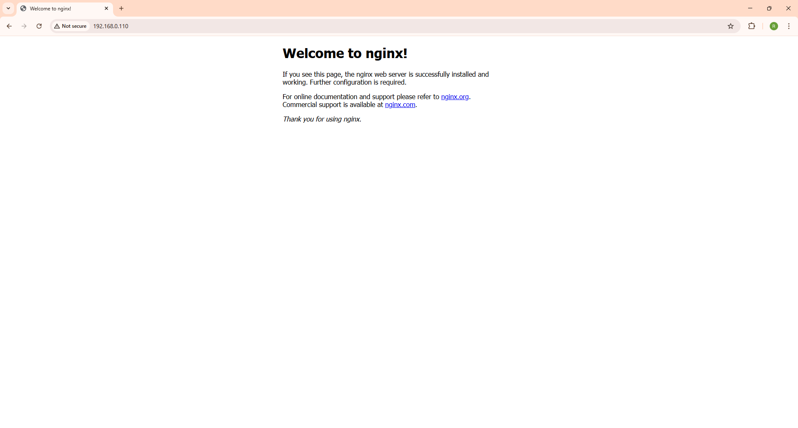

# 🌐 Nginx Configuration

> Custom nginx setup with a Splunk-optimized log format that powers the AI query agent.

---

## 📸 Nginx Serving Traffic

<!-- Add screenshot of nginx running / webpage being served -->


---

## What This Config Does

This nginx configuration does two important things for this project:

**1. Custom Log Format (`splunk_format`)** — every field is explicitly named so Splunk can extract them automatically without any manual field extraction rules.

**2. Structured Access Logs** — all requests are logged to `/var/log/nginx/access.log` using the custom format, which is then picked up by the Splunk Forwarder.

---

## 📋 Log Fields Captured

These are the exact fields written to `access.log` and available in Splunk:

| Field | Nginx Variable | Description |
|---|---|---|
| `remote_addr` | `$remote_addr` | Client IP address |
| `status` | `$status` | HTTP response status code |
| `request_method` | `$request_method` | GET, POST, PUT, DELETE |
| `uri` | `$uri` | Request path / endpoint |
| `bytes_sent` | `$bytes_sent` | Total bytes sent to client |
| `body_bytes_sent` | `$body_bytes_sent` | Bytes sent excluding headers |
| `request_time` | `$request_time` | Total request processing time (seconds) |
| `upstream_time` | `$upstream_response_time` | Backend response time (seconds) |
| `upstream_addr` | `$upstream_addr` | Backend server address |
| `server_name` | `$server_name` | Virtual host / domain name |
| `http_referer` | `$http_referer` | Referring URL |
| `http_user_agent` | `$http_user_agent` | Browser / client string |
| `args` | `$args` | Query string parameters |
| `request_length` | `$request_length` | Request size in bytes |
| `host` | `$host` | Host header value |

---

## 📄 Log File Locations

| File | Path | Purpose |
|---|---|---|
| Access Log | `/var/log/nginx/access.log` | All incoming requests |
| Error Log | `/var/log/nginx/error.log` | Nginx errors and warnings |

---

## ⚙️ Setup

### 1. Copy config to your server

```bash
sudo cp nginx.conf /etc/nginx/nginx.conf
```

### 2. Test the configuration

```bash
sudo nginx -t
```

You should see:
```
nginx: configuration file /etc/nginx/nginx.conf test is successful
```

### 3. Reload nginx

```bash
sudo systemctl reload nginx
```

### 4. Verify logs are being written

```bash
sudo tail -f /var/log/nginx/access.log
```

You should see structured log entries like:
```
192.168.0.105 - - [05/Mar/2026:15:58:26 +0530] "GET / HTTP/1.1" 200 409 "-" "Mozilla/5.0 (Windows NT 10.0; Win64; x64) AppleWebKit/537.36 (KHTML, like Gecko) Chrome/145.0.0.0 Safari/537.36" request_time=0.000 upstream_time=- upstream_addr=- host=192.168.0.110 server_name=_ request_method=GET uri=/index.nginx-debian.html args=- bytes_sent=667 request_length=569
192.168.0.105 - - [05/Mar/2026:15:58:27 +0530] "GET /favicon.ico HTTP/1.1" 404 196 "http://192.168.0.110/" "Mozilla/5.0 (Windows NT 10.0; Win64; x64) AppleWebKit/537.36 (KHTML, like Gecko) Chrome/145.0.0.0 Safari/537.36" request_time=0.000 upstream_time=- upstream_addr=- host=192.168.0.110 server_name=_ request_method=GET uri=/favicon.ico args=- bytes_sent=391 request_length=511

```

---

## 🔗 How It Connects to the Rest of the Project

```
nginx access.log
      ↓
Splunk Forwarder     (see ../splunk/)
      ↓
Splunk Indexer
      ↓
AI Query Agent       (see ../agents/query_agent/)
```

The custom `splunk_format` defined in this config is what makes the AI agent accurate — every field has a consistent name that Splunk indexes and the agent queries.