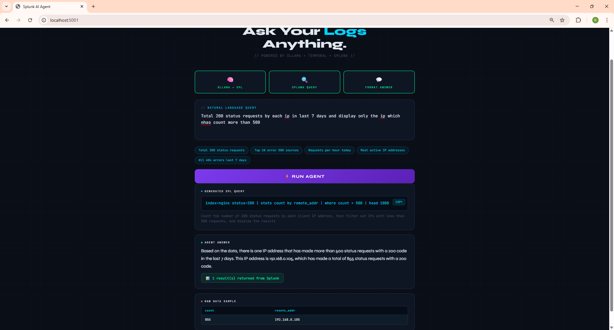
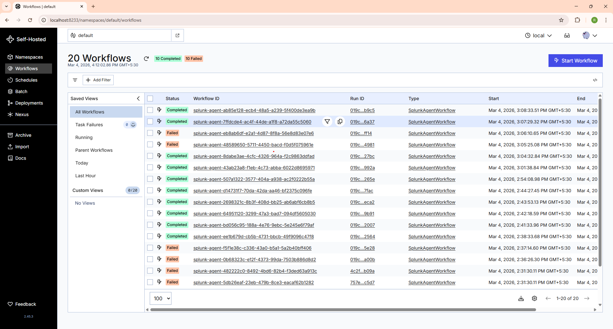
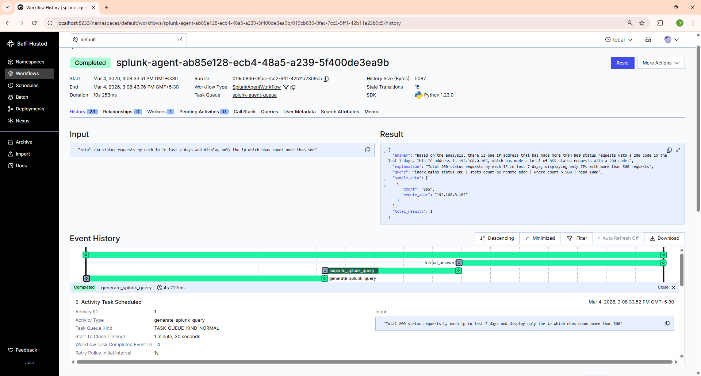
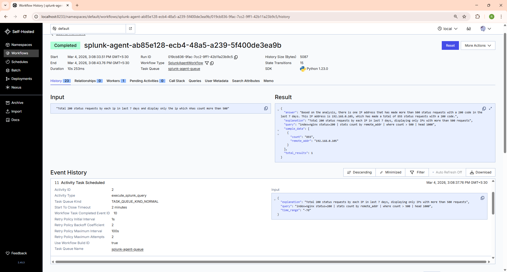
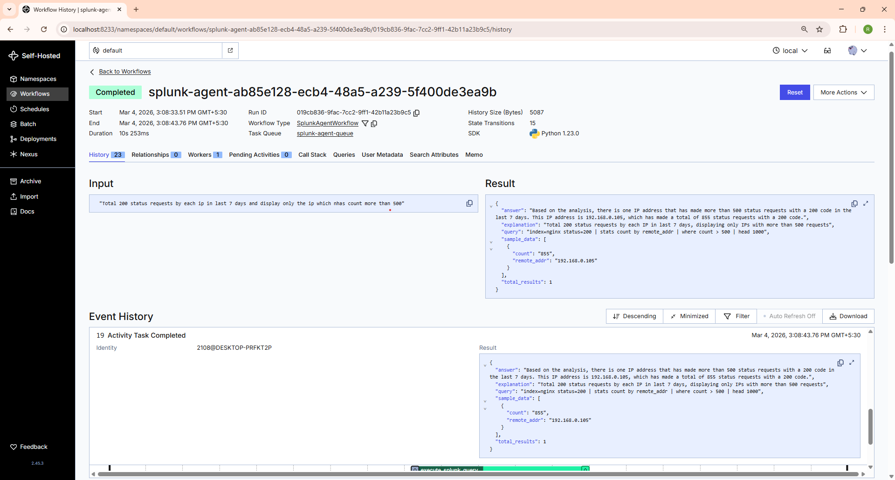
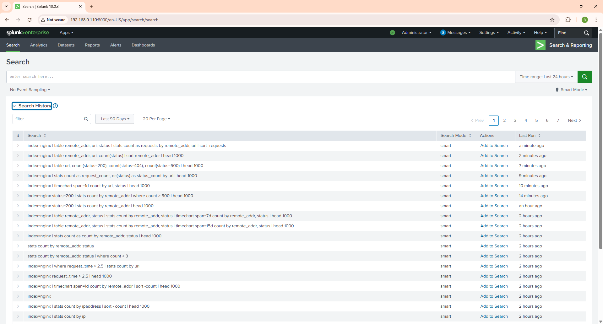

# 🔍 Query Agent

> Ask your nginx logs anything in plain English — get real Splunk data back instantly.

---

## 📸 UI Preview

<!-- Add screenshot of the main UI here -->


---

## 📸 Query Result

<!-- Add screenshot of a query result here -->


---

## How It Works
```
┌─────────────────────────────────────────────────────┐
│              Temporal Workflow (Durable)            │
│                                                     │
│  ┌──────────────┐  ┌─────────────┐  ┌───────────┐   │
│  │ Ollama       │→ │ Splunk      │→ │ Ollama    │   │
│  │ NL → SPL     │  │ REST API    │  │ Format    │   │
│  └──────────────┘  └─────────────┘  └───────────┘   │
└─────────────────────────────────────────────────────┘
         ↓                  ↓                ↓
    SPL Query          Raw Results      Plain English
                                          Answer
```

---

## 📁 Files

| File | Purpose |
|---|---|
| `activities.py` | NL→SPL, Splunk execution, answer formatting |
| `workflow.py` | Temporal workflow — orchestrates the 3 steps |
| `worker.py` | Temporal worker process |
| `app.py` | Flask web UI (port 5001) |


---

## 📋 Prerequisites

- Python 3.10+
- Splunk Enterprise running with REST API on port 8089
- Ollama installed and running locally
- Temporal CLI installed
- Nginx logs being forwarded to Splunk via Splunk Forwarder


## ⚙️ Setup

### 1. Configure credentials in `activities.py`
```python
SPLUNK_HOST  = "your-splunk-ip"
SPLUNK_PORT  = 8089
SPLUNK_USER  = "admin"
SPLUNK_PASS  = "your-password"
SPLUNK_INDEX = "nginx"
OLLAMA_MODEL = "llama3"
```

### 2. Start the agent
```bash
# Terminal 1 — Temporal server
temporal server start-dev

# Terminal 2 — Worker
python worker.py

# Terminal 3 — UI
python app.py
```

→ Open **http://localhost:5001**

---

## 💬 Example Prompts
```
Give me total number of requests with 200 response code
Show top 10 IPs by request count in the last 7 days
What are the slowest endpoints by average response time?
All 500 errors grouped by URI in the last 24 hours
Show bandwidth usage per endpoint in the last 15 days
For each IP show which URLs they hit, how many times,
and what status codes they received in the last 15 days
```

---

## 🗂️ Nginx Fields Supported

| Field | Description |
|---|---|
| `remote_addr` | Client IP address |
| `status` | HTTP status code (200, 404, 500…) |
| `request_method` | GET, POST, PUT, DELETE |
| `uri` | Request path / endpoint |
| `bytes_sent` | Response size in bytes |
| `request_time` | Processing time in seconds |
| `http_user_agent` | Browser / client string |
| `http_referer` | Referring URL |
| `upstream_addr` | Backend server address |
| `upstream_time` | Backend response time |
| `server_name` | Virtual host / domain |
| `protocol` | HTTP version |

---

## 🛠️ Troubleshooting

| Error | Fix |
|---|---|
| `401 Unauthorized` | Wrong Splunk credentials — run `test_splunk_auth.py` |
| `400 Bad Request` | Ollama generated invalid SPL — rephrase your question |
| `Connection refused` | Temporal not running — run `temporal server start-dev` |
| SSL Warning | Normal for self-signed certs — already suppressed in code |

## 🔧 Temporal Workflow UI

Monitor every step your agent takes at **http://localhost:8233**

## ⚡ Temporal Workflow Steps

Each step of the agent is tracked and visible in the Temporal dashboard at **http://localhost:8233**

<!-- Main Temporal dashboard screenshot -->


### Temporal Entire Workflow


### Step 1 — Generate SPL Query
<!-- Screenshot of generate_splunk_query activity -->


### Step 2 — Execute on Splunk
<!-- Screenshot of execute_splunk_query activity -->


### Step 3 — Format Answer
<!-- Screenshot of format_answer activity -->



## ✅ Proof of Work

### Splunk Query History
> Queries automatically generated and executed by the AI agent



```

