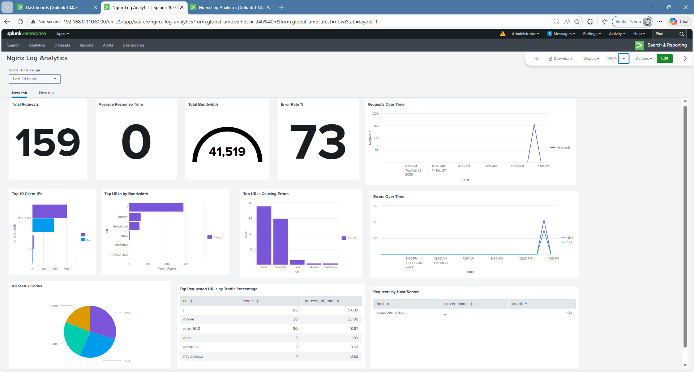
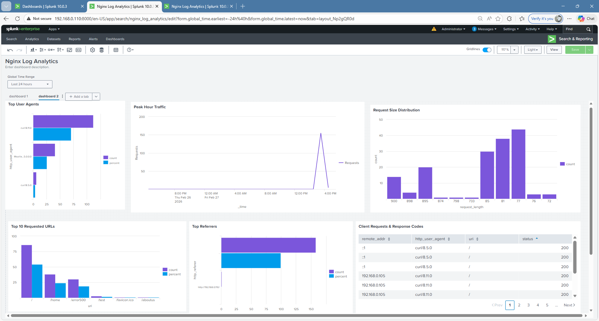
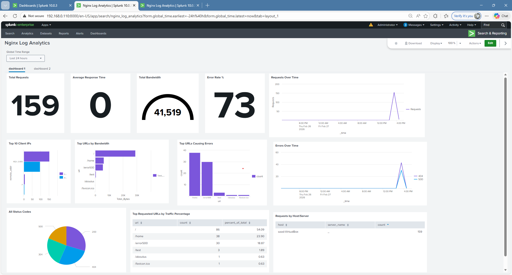
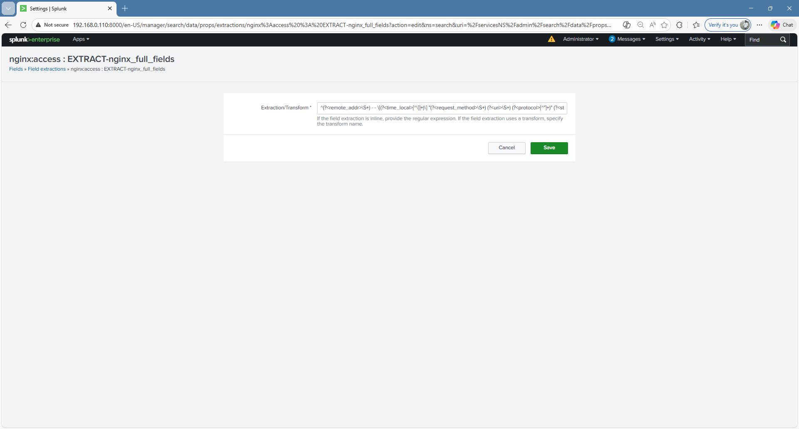
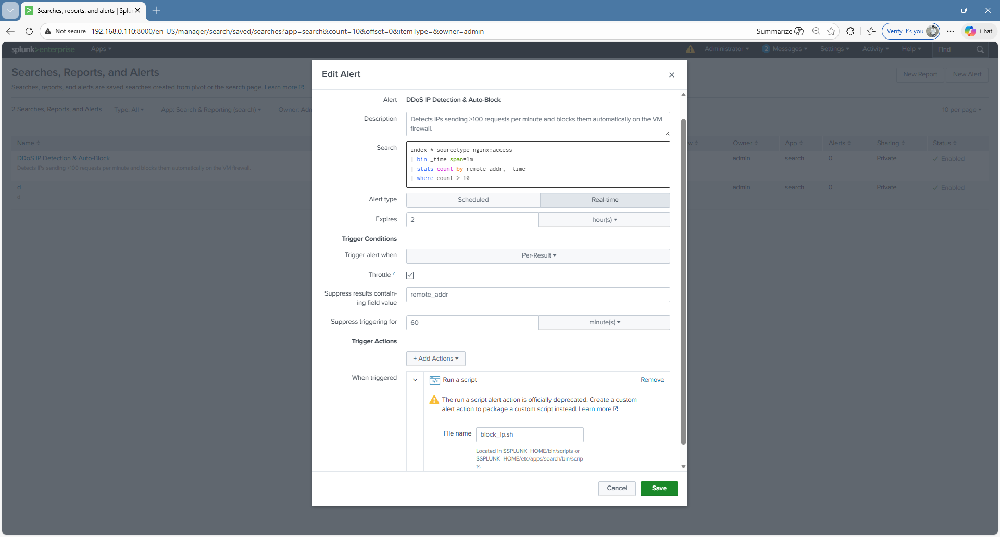
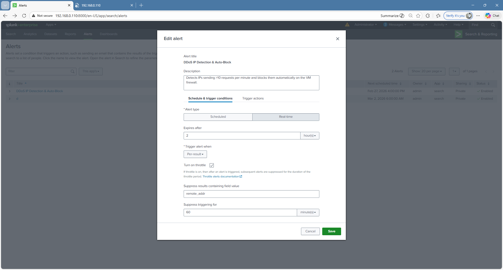
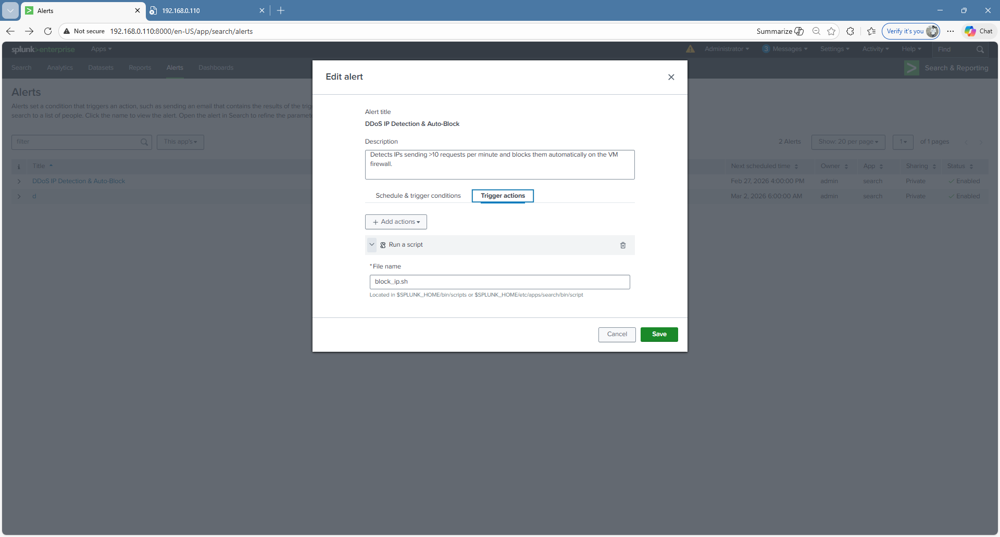

# 📊 Splunk Stack

> Splunk Forwarder on VM1 monitors nginx logs and forwards them to the Splunk Indexer in real time.

---

## Architecture

```
VM1 (nginx)
    │
    │  /var/log/nginx/access.log
    │  /var/log/nginx/error.log
    │
    ▼
Splunk Universal Forwarder
    │
    │  TCP port 9997
    │
    ▼
Splunk Indexer (index=nginx)
    │
    ▼
Splunk Web UI + REST API
    │
    ▼
AI Query Agent
```

---

## 📸 Splunk Dashboard

### Tab 1



### Tab 2



### Tab 3



---

## 📸 Field Extraction



---

## 📸 Alert Setup



## Schedule and Trigger Condition



## Trigger Action (FileName)



---

## 📸 Alert Triggered


---

## 📁 Files

| File | Location on Server | Purpose |
|---|---|---|
| `forwarder/inputs.conf` | `/opt/splunkforwarder/etc/system/local/inputs.conf` | Which logs to monitor |
| `forwarder/outputs.conf` | `/opt/splunkforwarder/etc/system/local/outputs.conf` | Where to forward logs |
| `indexer/indexes.conf` | `/opt/splunk/etc/system/local/indexes.conf` | Index definition |

---

## ⚙️ Setup

### 1. Install Splunk Universal Forwarder on VM1

```bash
# Download from https://www.splunk.com/en_us/download/universal-forwarder.html
wget -O splunkforwarder.deb "https://download.splunk.com/products/universalforwarder/releases/latest/linux/splunkforwarder-linux-amd64.deb"
sudo dpkg -i splunkforwarder.deb
```

### 2. Copy forwarder configs

```bash
sudo cp forwarder/inputs.conf  /opt/splunkforwarder/etc/system/local/inputs.conf
sudo cp forwarder/outputs.conf /opt/splunkforwarder/etc/system/local/outputs.conf
```

### 3. Edit outputs.conf — set your Splunk server IP

```bash
sudo nano /opt/splunkforwarder/etc/system/local/outputs.conf
# Replace YOUR_SPLUNK_IP with your actual Splunk server IP
```

### 4. Start the forwarder

```bash
sudo /opt/splunkforwarder/bin/splunk start --accept-license
sudo /opt/splunkforwarder/bin/splunk enable boot-start
```

### 5. Create nginx index on Splunk server

Either copy `indexer/indexes.conf` to `/opt/splunk/etc/system/local/` or via UI:

```
Splunk Web → Settings → Indexes → New Index
Name       : nginx
Index Type : Events
```

### 6. Enable receiving on Splunk server (port 9997)

```
Splunk Web → Settings → Forwarding and Receiving
          → Configure Receiving → New → Port: 9997
```

### 7. Verify logs are flowing

```bash
# On Splunk Web search bar run:
index=nginx | head 10
```

You should see nginx log events appearing.

---

## 📸 Splunk Query History


---

## 🔗 How It Connects to the Rest of the Project

```
nginx/nginx.conf          → defines log format
splunk/forwarder          → ships logs to Splunk
splunk/indexer            → stores logs in nginx index
agents/query_agent        → queries Splunk via REST API
automation/log_rotation   → manages log file sizes
```